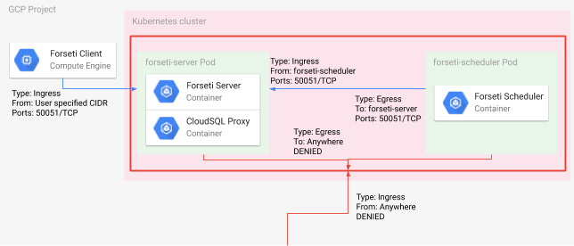

# Forseti Security

[Forseti Security](https://forsetisecurity.org/) is a suite of Open-source security tools for GCP.

## Prerequisites

1. Kubernetes Cluster 1.11+
2. A Forseti environment.  This can be created via the Forseti Security [install scripts](https://forsetisecurity.org/docs/latest/setup/install.html) OR the Forseti [Terraform module](https://registry.terraform.io/modules/terraform-google-modules/forseti/google/2.0.0). Specifically: <ol type="a"><li>A CloudSQL Instance</li><li>A forseti-server IAM service account</li><li>A forseti-server IAM service account</li><li>A forseti-client IAM service account (for the orchestrator)</li><li>A local copy of a service account key for the forseti-server and forseti-client IAM service accounts</li></ol>


## Production Configuration
Whether or not to deploy the forseti-security helm chart in a production configuration is controlled by the **production** value.  By default, this is set to **false**.  A production configuration presumes the existence of [Forseti infrastructure](https://forsetisecurity.org/docs/latest/concepts/architecture.html).  The required components are deployed via the Forseti Terrafom Module.  

In a non-production configuration (the default) there are no infrastructure requirements, save Kubernetes.  The only service enabled in the server is the *inventory* service.  The Forseti Orchestrator CronJob is not deployed.  The purpose is to demonstrate a simple deployment allowing for a ```forseti inventory list``` from a client with the CLI.

|                           | Production         | Non-Production (default)  |
|---------------------------|--------------------|---------------------------|
| Forseti Server Pod Container Images | <ul><li>gcr.io/forseti-containers/forseti:latest</li><li>gcr.io/cloudsql-docker/gce-proxy:latest</li></ul> | <ul><li>gcr.io/forseti-containers/forseti:latest</li><li>docker.io/mysql:5.7</li></ul> |
| SQL Data Persistence      | CloudSQL Instance       | EmptyDir Volume Mount |
| Server Configuration File | Value of **serverConfigContents** | files/forseti_conf_server.yaml.sample |
| Load Balancer             | <ul><li>none</li><li>internal</li><li>external</li></ul> | <ul><li>none</li></ul> |

## Quick start

The forseti-security Helm chart by default, deploys the Forseti server in a container running in a [Kubernetes Deployment](https://kubernetes.io/docs/concepts/workloads/controllers/deployment/).  This allows for an external Forseti client to access the server for operations such as ```forseti explain```.  The chart will also deploy a [CloudSQL Proxy container](https://cloud.google.com/sql/docs/mysql/connect-kubernetes-engine#proxy), in the same pod (and deployment) as the Forseti server.  This allows the Forseti server deployment to access the CloudSQL instance containing Forseti's database.

Optionally, a Forseti orchestrator can be deployed.  This is essentially a container with the Forseti client CLI installed.  It is deployed as a [Kubernetes CronJob](https://kubernetes.io/docs/concepts/workloads/controllers/cron-jobs/).  The schedule is user definable in the values.yaml.

## Installing the Forseti Security Chart

### Installing
The forseti-security Helm chart can be installed using the following as an example:
```bash
helm install --set production=true \
             --name forseti  \
             --set-string serverKeyContents="$(cat forseti-server.json | base64 - -w 0)" \
             --set-string orchestratorKeyContents="$(cat forseti-client.json | base64 - -w 0)" \
             --values=forseti-values.yaml \
             incubator/forseti-security
```
Note that certain values are required.  See the [configuration](#configuration) for details.

### Upgrading

The forseti-security Helm chart can be easily upgraded via the ```helm upgrade``` command.  For example:
```bash
helm upgrade -i forseti incubator/forseti-security \
    --set production=true \
    --recreate-pods \
    --set-string serverKeyContents="$(cat forseti-server.json | base64 - -w 0)" \
    --set-string orchestratorKeyContents="$(cat forseti-client.json | base64 - -w 0)" \
    --values=forseti-values.yaml
```

### Uninstalling the Chart

To uninstall/delete the `<RELEASE_NAME>` deployment:

```bash
helm delete <RELEASE_NAME> --purge
```

The command removes all the Kubernetes components associated with the chart and deletes the release.

## Configuration

As a best practice, a YAML file that specifies the values for the chart parameters should be provided to configure the chart:

**Copy the default [`forseti-security-values.yaml`](values.yaml) value file.**

```bash
helm install -f forseti-security-values.yaml <RELEASE_NAME> incubator/forseti-security
```

See the [All configuration options](#all-configuration-options) section to discover all possibilities offered by the Forseti Security chart.

### Pod NetworkPolicy

Optionally, the forseti-security helm chart can be deployed with a [Kubernetes Pod NetworkPolicy](https://kubernetes.io/docs/concepts/services-networking/network-policies/).  NetworkPolicies provide controls over how pods communicate with one another.  In GKE, [network policy enforcement](https://cloud.google.com/kubernetes-engine/docs/how-to/network-policy#using_network_policy_enforcement) must be enabled for Pod NetworkPolicies to take effect.

In this implementation, the NetworkPolicy allows forseti-orchestrator to communicate the forseti-server and only the forseti-server.  It also for the forseti-server to receive traffic from the forseti-orchestrator and only the forseti-orchestrator.  However, if client CLI accesses the server from outside the Kubernetes cluster, then the **networkPolicyIngressCidr** must be defined.  Each item in this list is a CIDR range from which to allow communications to the forseti-server.



## All Configuration Options

The following table lists the configurable parameters of the Forseti Security chart and their default values. Specify each parameter using the `--set key=value[,key=value]` argument to `helm install`. For example,

```bash
helm install incubator/forseti-security \
    --name forseti \
    --set production=true
    --set-string orchestratorKeyContents="$(cat PATH_TO_CLIENT_KEY_JSON| base64 - -w 0)" \
    --set-string serverKeyContents="$(cat PATH_TO_SERVER_KEY_JSON | base64 - -w 0)" \
    --values forseti-values.yaml
    
```

| Parameter                                | Description                                    | Default|
| ----------------------------- | ------------------------------------ |------------------------------------------- |
| **cloudsqlConnection**        | This is the connection to the CloudSQL instance.          | `nil`|
| loadBalancer                  | Deploy a Load Balancer allowing access to the Forseti server ['none', 'internal', 'external'] | `none` |
| networkPolicyEnable           | Enable pod network policy to limit the connectivty to the server | `false` |
| networkPolicyIngressCidr      | A list of CIDR's from which to allow communication to the server.  This is only relevant for client connectivity from outside the Kubernetes cluster. | `[]` |
| orchestratorDeploy            | Whether or not to deploy the orchestrator.                | `true`|
| orchestratorImage             | The container image used by the orchestrator.             | `gcr.io/forseti-security-containers/forseti`|
| orchestratorImageTag          | The tag for the orchestrator container image              | `dev` |
| **orchestratorKeyContents**   | The Base64 encoded JSON credentials for the orchestrator.  This can be the IAM service account key for the Forseti Client.| `nil`|
| production                    | Deploy in a production configuration                      | `false`|
| rulesBucket                   | The GCS bucket containing the rules.  Often this is the same as the serverBucket.  Ommit the "gs://".| serverBucket |
| rulesBucketFolder             | The Folder inside the rulesBucket containing all the rules.| `rules`|
| **serverBucket**              | The GCS bucket used by the Forseti server.  Omit the "gs://" | `nil`|
| **serverConfigContents**      | The Base64 encoded contents of the forseti_conf_server.yaml file.| `nil`|
| serverImage                   | The container image used by the server.                   | `gcr.io/forseti-security-containers/forseti:latest`|
| serverImageTag                | The tag for the server container image              | `dev` |
| **serverKeyContents**         | The Base64 JSON credentials for the server                       | `nil`|
| serverLogLevel                | The log level for the server.                             | `info` |
| serverSchedule                | The cron schedule for the server.  The default is every 60 minute.    | `"*/60 * * * *"` Every 60 minutes|

**NOTE:** Bolded parameters denotes a required value.
