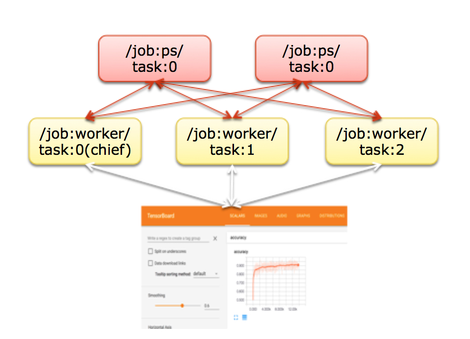

# Distributed TensorFlow

TensorFlow is an open source software library for numerical computation using data flow graphs, and it supports distributed computing, allowing 'data parallel' or 'model parallel' on different servers. This means data scientists can now scale out distributed training to 100s of GPUs using TensorFlow. 

-  https://www.tensorflow.org
-  https://www.tensorflow.org/deploy/distributed



## Prerequisites

- Kubernetes cluster v1.8+ 

## Chart Details

This chart will create a TensorFlow cluster, and distribute a computation graph across that cluster. 

## Installing the Chart

* To install the chart with the release name `mnist`:

  ```bash
  $ helm install --name mnist incubator/distributed-tensorflow
  ```

* To install with custom values via file:

  ```
  $ helm install  --values values.yaml  --name mnist  incubator/distributed-tensorflow
  ```

  Below is an example of the custom value file values.yaml with GPU support.

  ```
  worker:
    number: 2
    podManagementPolicy: Parallel
    image:
      repository: cheyang/distributed-tf
      tag: 1.6.0-gpu
    port: 9090
    gpuCount: 1

  ps:
    number: 2
    podManagementPolicy: Parallel
    image:
      repository: cheyang/distributed-tf
      tag: 1.6.0
      pullPolicy: IfNotPresent
    port: 8080

  # optimize for training
  hyperparams:
    batchsize: 20
    learningrate: 0.001
    trainsteps: 10000
  ```

> Notice: you can check the details of docker image from [Docker hub](https://hub.docker.com/r/cheyang/distributed-tf/)

## Uninstalling the Chart

* To uninstall/delete the `mnist` deployment:

	```bash
	$ helm delete mnist
	```

The command removes all the Kubernetes components associated with the chart and deletes the release.

## Configuration

The following table lists the configurable parameters of the Service Distributed Tensorflow
chart and their default values.

| Parameter | Description | Default |
|-----------|-------------|---------|
| `worker.image.repository` | TensorFlow Worker Server's image repository | `cheyang/distributed-tf` |
| `worker.image.tag` | TensorFlow Worker Server's image tag | `gpu` |
| `worker.image.pullPolicy` | image pullPolicy for the  worker | `IfNotPresent` |
| `worker.gpuCount` | Set the gpu to be allocated and allowed for the Pods | `0` |
| `ps.image.repository` | TensorFlow Parameter Server's image repository | `cheyang/distributed-tf` |
| `ps.image.tag` | TensorFlow Parameter Server's image tag | `1.6.0-gpu` |
| `ps.image.pullPolicy` | image pullPolicy for the  ps | `IfNotPresent` |

