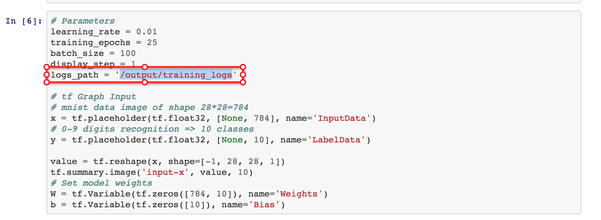
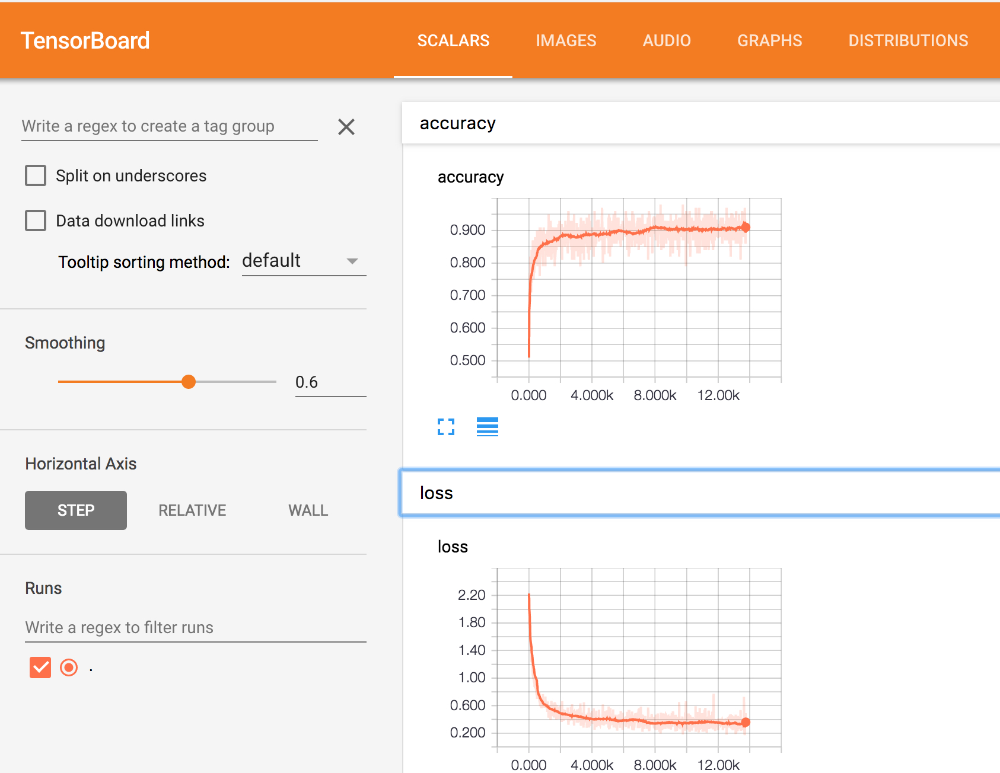

# ⚠️ Repo Archive Notice

As of Nov 13, 2020, charts in this repo will no longer be updated.
For more information, see the Helm Charts [Deprecation and Archive Notice](https://github.com/helm/charts#%EF%B8%8F-deprecation-and-archive-notice), and [Update](https://helm.sh/blog/charts-repo-deprecation/).

# TensorFlow Notebook Helm Chart

TensorFlow is an open source software library for numerical computation using data flow graphs, and tensorboard is the tool visualizing TensorFlow programs. Using Jupyter notebook to get into TensorFlow and develop models is the great way for data scientist. With these three tools you are able to start your machine learning work in two minutes.

-  https://www.tensorflow.org
-  https://www.tensorflow.org/programmers_guide/summaries_and_tensorboard
-  http://jupyter.org/

## DEPRECATION NOTICE

This chart is deprecated and no longer supported.

## Prerequisites

- Kubernetes cluster v1.8+ 

## Chart Details

This chart will deploy the followings:

- Jupyter Notebook with TensorFlow
- Tensorboard

## Installing the Chart

* To install the chart with the release name `notebook`:

  ```bash
  $ helm install --name notebook stable/tensorflow-notebook
  ```

* To install with custom values via file :
  
  ```
  $ helm install  --values values.yaml  --name notebook  stable/tensorflow-notebook
  ```
  
  Below is an example of the custom value file values.yaml with GPU support.
  
  ```
  jupyter:
    image:
      repository: tensorflow/tensorflow
      tag: 1.6.0-devel-gpu
      pullPolicy: IfNotPresent
    password: tensorflow
    resources:
      limits:
        nvidia.com/gpu: 1
    requests:
        nvidia.com/gpu: 1
  tensorboard: 
    image:   
      repository: tensorflow/tensorflow
      tag: 1.6.0-devel
      pullPolicy: IfNotPresent
  service:
    type: LoadBalancer
  ```


## Run TensorFlow Example [tensorboard_basic.ipynb](https://github.com/cheyang/TensorFlow-Examples/blob/master/notebooks/4_Utils/tensorboard_basic.ipynb)

> Notice: you should set the log_path  `/output/training_logs`



## Check the TensorBoard



## Uninstalling the Chart

* To uninstall/delete the `notebook` deployment:

	```bash
	$ helm delete notebook
	```

The command removes all the Kubernetes components associated with the chart and deletes the release.

## Configuration

The following table lists the configurable parameters of the Service Tensorflow Development
chart and their default values.

| Parameter | Description | Default |
|-----------|-------------|---------|
| `jupyter.image.repository` | TensorFlow Development image repository | `tensorflow/tensorflow` |
| `jupyter.image.tag` | TensorFlow Development image tag | `1.5.0-devel-gpu` |
| `jupyter.password` | The password to access jupyter | `mytest` |
| `jupyter.image.pullPolicy` | image pullPolicy for the  jupyter | `IfNotPresent` |
| `tensorboard.image.repository` | TensorFlow Development image repository | `tensorflow/tensorflow` |
| `tensorboard.image.tag` | TensorFlow Development image tag | `1.5.0-devel-gpu` |
| `tensorboard.image.pullPolicy` | image pullPolicy for the  tensorboard | `IfNotPresent` |
| `resources` | Set the resource to be allocated and allowed for the Pods | `{}` |
| `service.type` | service type | `LoadBalancer` |
